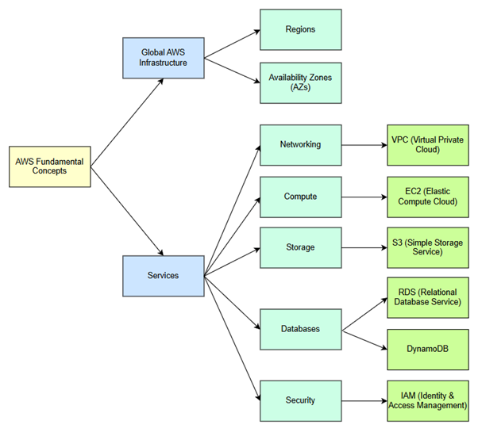

  ### **Understanding AWS Concepts**
Fundamental concepts:

[Amazon Bedrock](/Portfolio/AWS%20Fundamentals/Amazon%20Bedrock/README.md)

[Cloudfront](/Portfolio/AWS%20Fundamentals/Cloudfront/README.md)

[Cloudwatch](/Portfolio/AWS%20Fundamentals/CloudWatch/README.md)

[DynamoDB](/Portfolio/AWS%20Fundamentals/DynamoDB/README.md)

[EC2](/Portfolio/AWS%20Fundamentals/EC2/README.md)

[ELB](/Portfolio/AWS%20Fundamentals/ELB/README.md)

[IAM](/Portfolio/AWS%20Fundamentals/IAM/README.md)

[Lambda](/Portfolio/AWS%20Fundamentals/Lambda/README.md)

[Open Source](/Portfolio/AWS%20Fundamentals/Opensource/README.md)

[RDS](//Portfolio/AWS%20Fundamentals/RDS/README.md)

[Route 53](/Portfolio/AWS%20Fundamentals/Route53/README.md)

[S3](/Portfolio/AWS%20Fundamentals/S3/README.md)

[Security Group](/Portfolio/AWS%20Fundamentals/Security%20Group/README.md)

[SES](/Portfolio/AWS%20Fundamentals/SES/README.md)

[SNS](/Portfolio/AWS%20Fundamentals/SNS/README.md)

[VPC](/Portfolio/AWS%20Fundamentals/VPC/README.md)